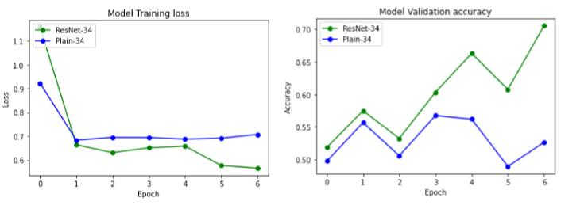
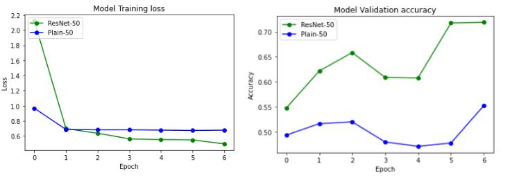
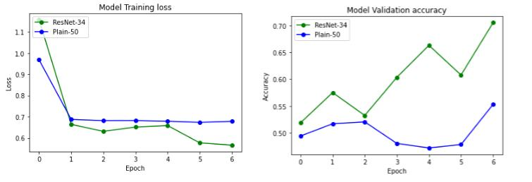
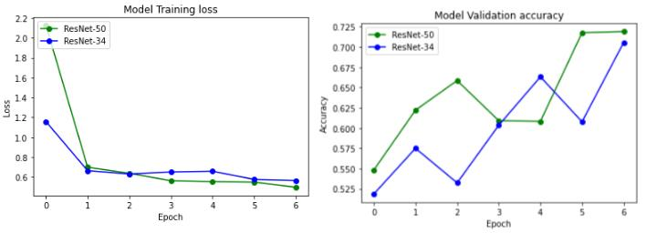
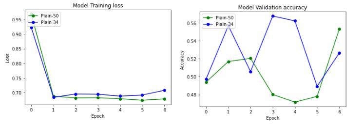
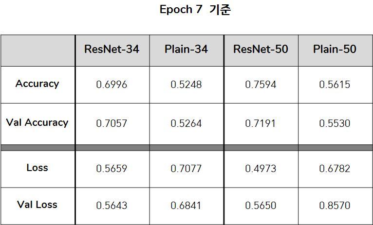

## Residual Network - keras

Residual networks implementation using Keras-2.4.0 functional API.   
Implementation of plain network and residual network from the paper  
- Plain-34, Plain-50  [no shortcut]

- ResNet-34,  ResNet-50 [using shortcut]

--- 

ResNet-34, ResNet-50과 Plain-34, Plain-50을 구현해서 비교했습니다.  
Epoch는 7로 짧게 돌려서 추이만 살피고자 했습니다.  

총 5가지의 비교를 통해서 ResNet이 Plain보다 더 좋은지 결과를 봤고 ResNet 구조가 더 깊을수록 좋은지도 비교했습니다. 

---

### ResNet-34, Plain-34 비교
   - Residual block 아닐때의 ResNet과 Plain 비교
   

---

### ResNet-50, Plain-50 비교
    - Residual block 일때의 ResNet과 Plain 비교
    

---

### ResNet-34, Plain-50 비교
    - layer의 깊이가 깊기만 해서 더 좋은 결과가 나오는지 비교   **[ shortcut ]**   
    

---

### ResNet-34 ResNet-50 비교
    - Residual block을 적용한 구조와 아닌 ResNet 구조의 비교

---

### Plain-34, Plain-50 비교
    - 그렇다면 shortcut이 없을때 layer가 더 깊을수록 좋은 성능인지 비교
    

---

 

### Ablation Study 결과표

---

ResNeet-34보다 ResNet-50의 성능이 더 좋으며 Epoch가 7로 적게 돌렸기에 Plain-34, 50에서 Vanishing Gradient 현상이 나타나진 않았다.  
네트워크의 성능은 shortcut과 Residual-block를 적용할 수록 더 좋은 성능을 보인다.
